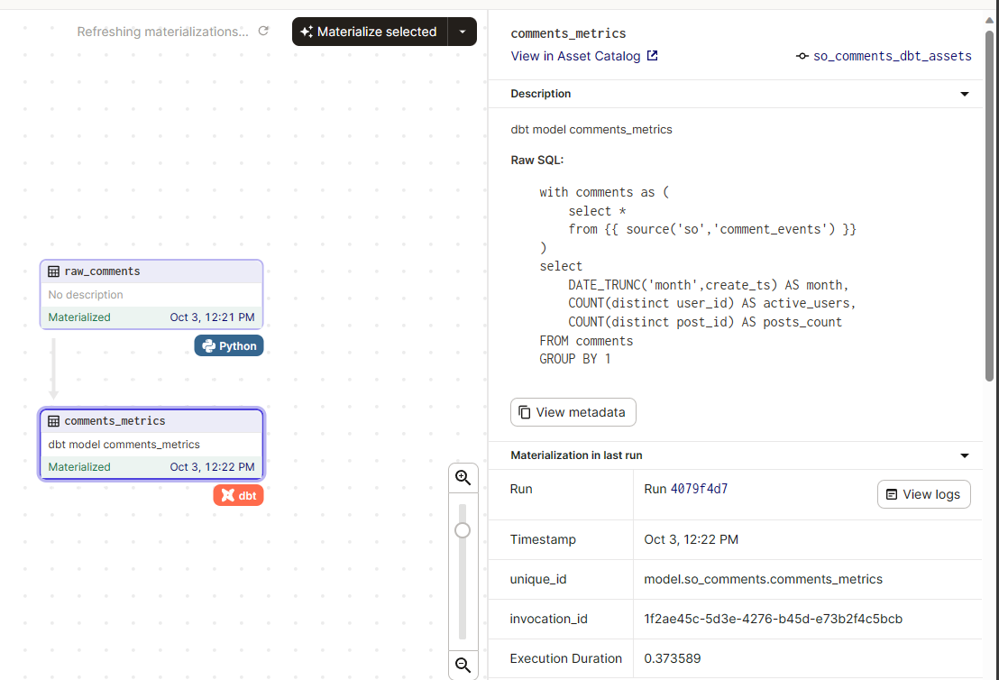

# 3D SANDBOX (DAGSTER-DBT-DUCKDB)

A portable easy running sandbox stack (made of Dagster - DBT - Duckdb) to build and test ETL pipelines or maintaining a mini-warehouse

## Components

- Dagster : Multi-faceted dataflow orchestrator
- DBT : Data build tool
- DuckDB - Lightweight superfast OLAP DB

## Structure

This is a single container system which can be spin up for building and managing datasets and data pipelines.
These folders are externally mounted to container so it can be persisted for re-use

- `src` - DBT and Dagster Assets reside here. Can house multiple projects under same folder
- `apps` - duckdb is downloaded and persisted here for the first time (Deatils are in `initialize.sh`)
- `data` - data folder to house raw datasets (Input), duckdb files and any output files that are generated

## Pipeline Context

The sample dataset contains sample comments dataset from the [Stackoverflow dumps](https://archive.org/details/stackexchange) in the form of XML. A DBT model is created
to compute simple metrics like Active users, post count over the dataset.

1. `raw_comments` - parse the input XML file and generate the raw datasets in duckdb
2. `comments_metrics` - compute metrics and apply tests

## Running the piipelines

1 - Download raw datasets manually or add scripts to this repo
2 - Run `initialize.sh` to setup the sandbox
3 - Place the dataset within the `/data/raw` folder or add an asset to auto-ingest into the `/data/raw` folder
4 - Develop projects within `src` folder via DBT and Dagster
5 - DBT packages include `dbt-expectations` to rich test cases
6 - Materialize dagster assets via Dagster UI

Inspired by this [dbt-dagster tutorial](https://docs.dagster.io/integrations/dbt/using-dbt-with-dagster)